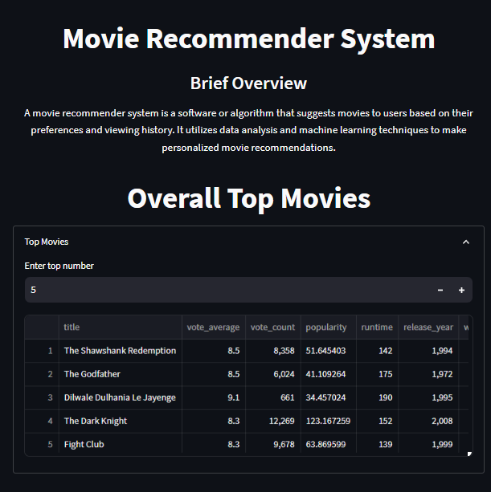
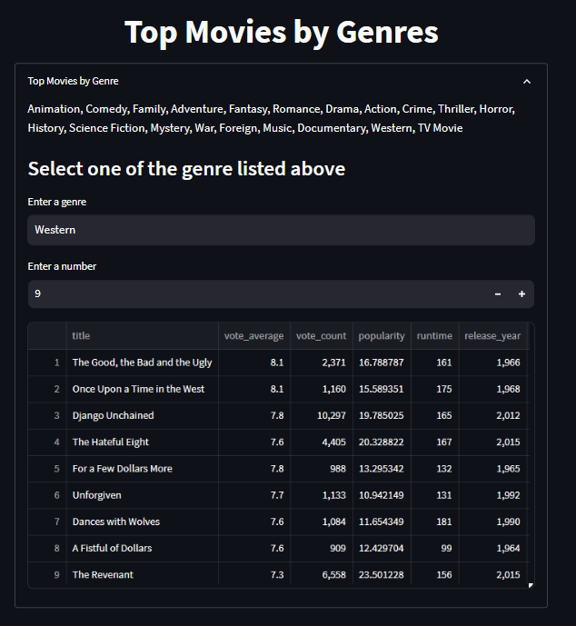

# Movie Recommender System

[App Link](https://movie-recommender-telrich.streamlit.app/)

## Overview
A movie recommender system is a software or algorithm that suggests movies to users based on their preferences and viewing history. It utilizes data analysis and machine learning techniques to make personalized movie recommendations.

## Setup
- Make sure you have Python 3.7 or above installed.
- Install the required libraries by running the following command:

`pip install -r requirements.txt`

## How the app look like

## Limitation
Certainly! Based on the code provided for the slide, here are a few potential limitations:

1. **Data Size**: The code uses a subset of the dataset (`sample`) containing only 1000 movies. This limited dataset may not capture the full diversity and range of movies, potentially impacting the accuracy and coverage of the recommendations.

2. **Content-Based Approach**: The recommender system in the code is based on content-based filtering, which relies on movie metadata such as genres, cast, and keywords. While this approach can provide personalized recommendations, it may not consider other important factors like user preferences, social trends, or collaborative filtering.

3. **Cold Start Problem**: The code doesn't address the "cold start" problem, which refers to situations where there is limited or no user data available for new users. In such cases, the recommender system may struggle to provide accurate recommendations since it heavily relies on user preferences and history.

4. **Limited User Interaction**: The code doesn't incorporate user interaction or feedback mechanisms to refine the recommendations over time. Adding user ratings or feedback functionality could enhance the system's ability to adapt and improve the recommendations based on user preferences.

5. **Scalability**: As the code uses cosine similarity to calculate recommendations, the performance may decrease with larger datasets. For larger datasets, more efficient algorithms or techniques like matrix factorization or approximate nearest neighbors could be considered.